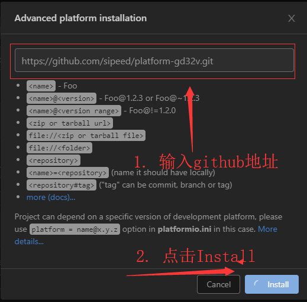

PIO configuration
=====

## Install VSCode
VS CODE is a more common development tool. Go to the VSCode official website and download and install the installation package for the corresponding operating system version.

## Install the PIO plugin
Open VSCode -> click on the left extension -> search for PlatformIO -> click install plugin -> wait for the installation to complete -> restart VSCODE


## Install the GD32V platform definition

PIO currently offers both **command line** and **graphical interface** installation. The following will introduce:
(PS: Recommended command line, because you can see the download progress bar.)

### Command line

Click the PlatformIO logo on the left -> click New Terminal at the bottom left -> execute the following installation command in the terminal window

* Development version (synchronized with Github)
```
platformio platform install https://github.com/sipeed/platform-gd32v
```

 
Note: Due to the domestic network environment, the installation process takes a long time, please be patient.

* ~~Release version (stable version)~~ (The stable version has not been released yet, this command is invalid)
```
platformio platform install gd32v
```

### Graphical interface

Open VS CODE -> click on the PIO icon on the left -> click on the Open option at the bottom left -> click on the Platforms page -> click on Advanced Installation to open the add window


Enter the following URL in the window that opens
```
https://github.com/sipeed/platform-gd32v.git
```

Click Install to add it.



Wait patiently to install successfully. (The installation failure is mostly for network reasons, please try again after replacing the network environment) 


