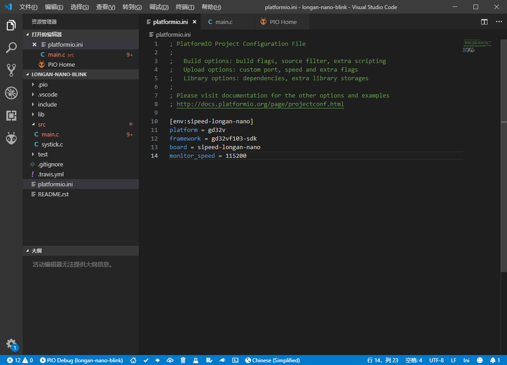
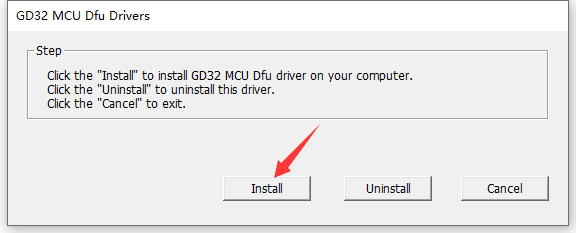
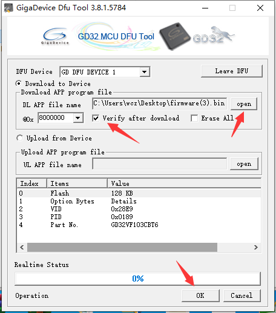

Blink 闪灯程序
=====

## 创建 Blink 工程

* 打开 PIO 主页 选择 `Project Examples`


* 选择 `arduino blink` 点击 `Import` 导入示例程序 （初次导入需要下载架构文件及工具，需要等待较长时间）


* 导入成功后即可见到示例工程


## 工程配置文件


* 我们首先需要编辑工程配置文件 `platformio.ini` 根据自己的开发板型号，删掉其他开发板环境。



配置示例
```ini
[env:sipeed-longan-nano]
platform = gd32v          ;平台，选择gd32v
framework = arduino       ;可选 gd32vf103_firmware_library 或 arduino
board = sipeed-longan-nano ; 开发板
monitor_speed = 115200     ; 串口监视器botelv
upload_tool = serial       ; 下载工具 默认串口， 可选jlink、gd-link、dfu等
debug_tool = jlink         ; 调试工具 默认jlink ，可选gd-link
```

## 一键编译

点击左下角的 `Build` 即可构建项目


## 连接开发板
### 串口 ISP 下载
* 准备USB 转 串口下载器
* 连接开发板与下载器
* 开发板按住 `BOOT` 键，再按 `RESET` 键重启开发板后再松开 `BOOT` 键，开发板进入下载模式。

### JTAG 下载
* 准备J-link 或 GD-Link 
* 连接开发板

### USB DFU 下载
下载DFU工具：http://dl.sipeed.com/LONGAN/Nano/Tools/GD32_MCU_Dfu_Tool_V3.8.1.5784_1.rar

解压出两个文件夹：

GD32 MCU Dfu Drivers_v1.0.1.2316  和 GD32 MCU Dfu Tool_v3.8.1.5784

先进入driver文件夹，安装对应的驱动文件，注意使用管理员权限运行



运行 GD32 MCU Dfu Tool.exe 
将 Longan Nano 插到电脑，按住 Boot0 键，短按 Reset 键，再松开 Boot0 键，
可以看到 DFU 工具中识别到了 GD32VF 芯片

选择对应的固件文件，并勾选烧录后校验，点击OK，即可进行烧录

烧录完成之后不会自动复位，需要自己手工按下复位按键，查看运行效果



## 一键下载

点击左下角的 `Upload` 即可上传程序。

