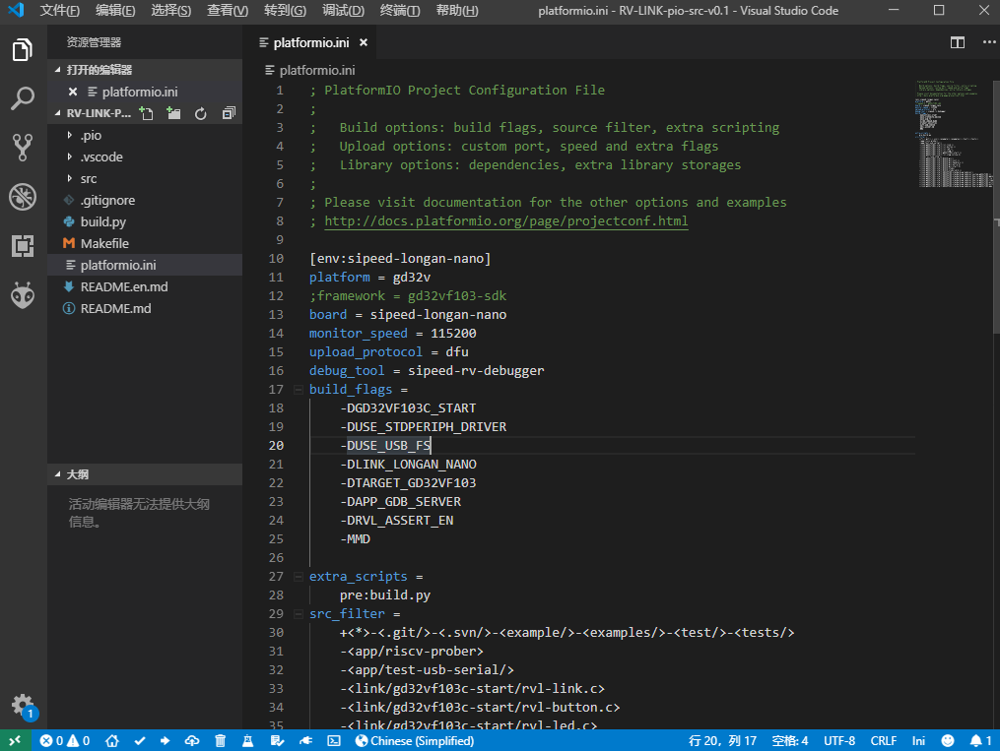

使用 RV-LINK
=========

## 什么是 RV-LINK

**RV-LINK** 是一个基于 RISC-V 开发板的仿真器固件，通过烧写 **RV-LINK** 固件， 可以将 **Sipeed Longan Nano** 开发板变成一个 `jtag` 调试器，用来调试另一块 Longan 或者其他支持 jtag 调试的开发板。 RV-LINK 项目地址: [https://gitee.com/zoomdy/RV-LINK](https://gitee.com/zoomdy/RV-LINK)

## 烧写 RV-LINK 固件

### 使用 PlatformIO 工程一键烧录
* 下载 RV-LINK 源码
        
    项目源码下载地址：[http://dl.sipeed.com/LONGAN/Nano/Tools/RV-LINK-pio-src-v0.1.zip](http://dl.sipeed.com/LONGAN/Nano/Tools/RV-LINK-pio-src-v0.1.zip)
    
    也可以从RV-LINK官方项目下载: [https://gitee.com/zoomdy/RV-LINK](https://gitee.com/zoomdy/RV-LINK)
* 使用 VSCODE 打开工程目录
    
    将上面下载的源码解压到单独的文件夹
    然后使用 VSCODE 打开源码文件夹

    如下图所示：
    

    通常使用 DFU 方式烧录固件，**不需要**修改配置文件。
    
    如果需要更改烧录方式，可以通过修改 `platformio.ini` 文件来修改， 具体配置方式请参考：[修改工程配置文件](blink.md/#工程配置文件) 

* 使用 PIO 烧录固件

    连接开发板，使开发板进入烧录模式后，点击左下角的箭头符号即可进行烧录。

    烧录成功后，可以看到开发板上的绿灯闪烁，将开发板连接到电脑USB口之后，可以在设备管理器中看到多出了一个串口设备。此时 Longan 板子就成功变成了 RV-LINK 调试器。

### 其他烧录方式

参考文档： [将 Longan Nano 开发板变成 RISC-V 仿真器](https://gitee.com/zoomdy/RV-LINK/wikis/%E5%B0%86%20Longan%20Nano%20%E5%BC%80%E5%8F%91%E6%9D%BF%E5%8F%98%E6%88%90%20RISC-V%20%E4%BB%BF%E7%9C%9F%E5%99%A8)

## 使用 RV-LINK 调试

### 在 PlatformIO IDE 中使用 RV-LINK

RV-LINK 在 PlatformIO IDE 可以和其他调试器一样，支持一键启动调试。

只需要在工程的 `platformio.ini` 配置文件中，指定调试器选项和调试器端口选项。

示例代码

```ini
[env:sipeed-longan-nano]
platform = gd32v
framework = gd32vf103-sdk
board = sipeed-longan-nano
monitor_speed = 115200
upload_protocol = rv-link ; rv-link下载选项
debug_tool = rv-link ; rv-link调试选项
debug_port = COM2    ; 使用rv-link 必填此项 调试器串口 
```

### 在其他平台使用 RV-LINK

参考 [RV-LINK WIKI](https://gitee.com/zoomdy/RV-LINK/wikis/)